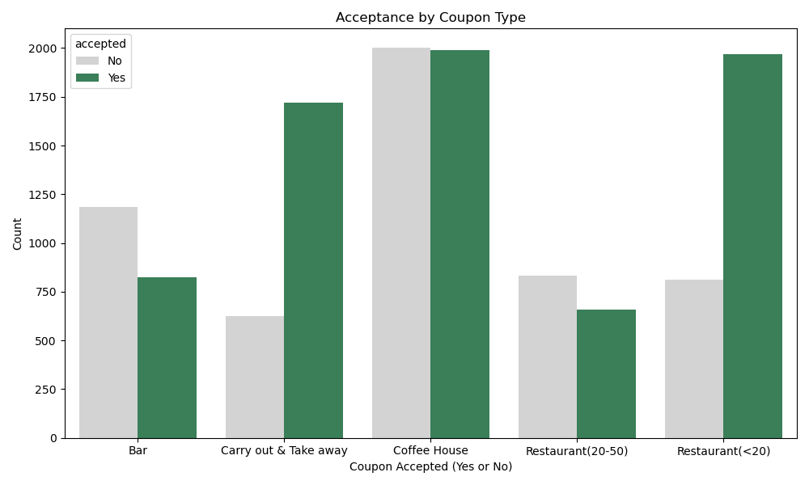
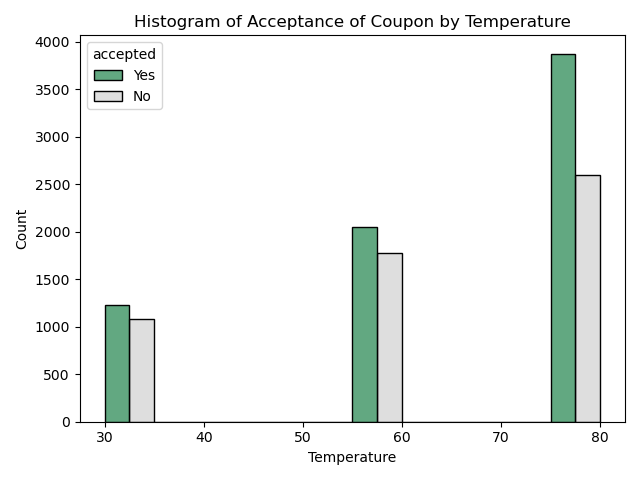
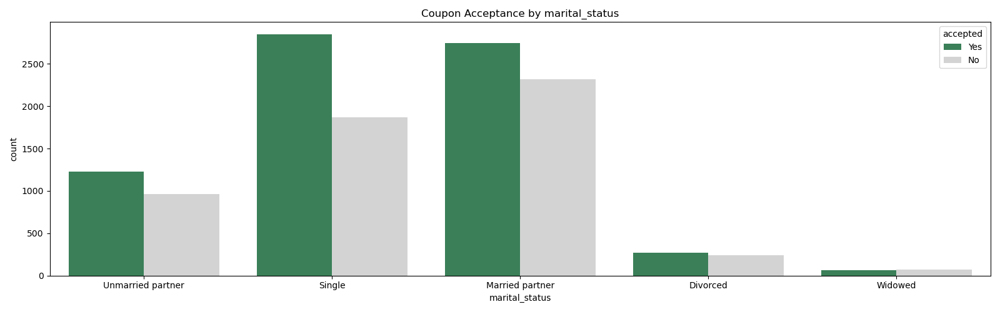
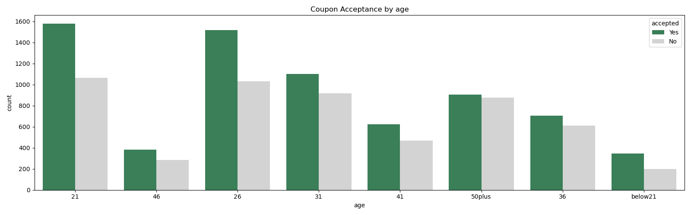
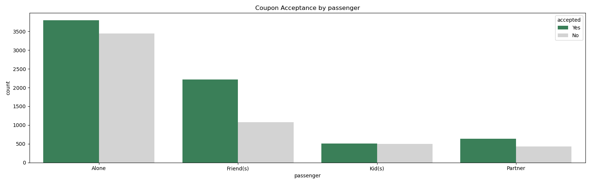
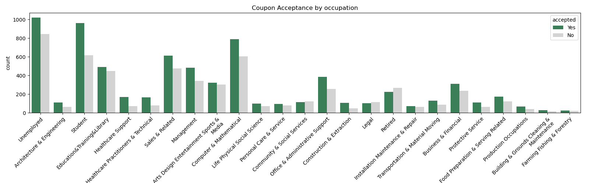
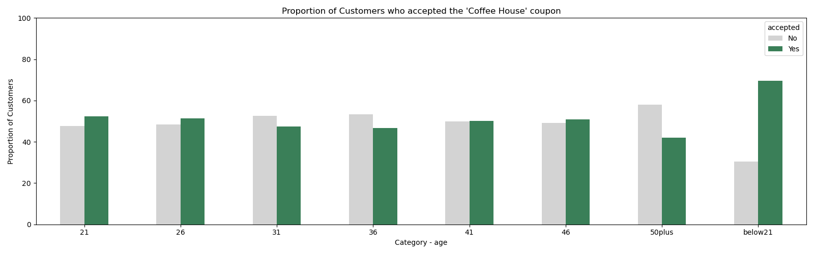
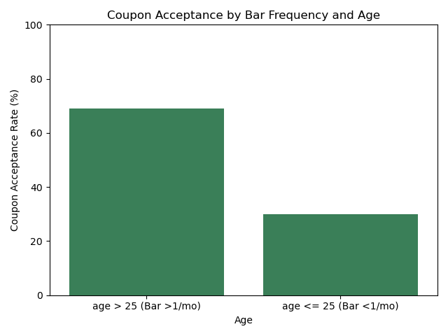

# Will the Customers Accept the Coupons?

This project analyzes the `coupons.csv` dataset, collected via a survey on Amazon Mechanical Turk.

#### 📂 Directory Structure

- Base Directory: `coupon-app1/`  
- Notebook: `coupon-app1/coupon_survey.ipynb`  
- Dataset: `coupon-app1/data/coupons.csv`  
- Visualizations: `coupon-app1/images/`

#### 🔍 Data Analysis

Conducted in the Jupyter Notebook `coupon_survey.ipynb`:
- Data cleaning and preprocessing
- Exploratory Data Analysis (EDA) with visualizations  

#### 📊 Visualizations

Visual outputs from the analysis are stored in the `images/` directory. These visualizations highlight:
- Patterns and trends in consumer behavior  
- Comparisons and distributions of key variables  

#### 📌 Conclusions

Based on the data analysis, it's clear that the ideal target audience should vary depending on the type of coupon offered. 

Key Findings:

- Lower-value coupons tend to have higher acceptance rates, suggesting that smaller incentives may be more effective in driving engagement.

- Warmer temperatures are associated with increased coupon acceptance, likely because people are more active and spend more time outdoors.

- Demographic factors such as age, marital status, education, and income play a significant role. Campaigns should focus on:

- Younger, single individuals with higher education levels and mid-range incomes.

- People traveling with friends or partners, who show greater interest in using coupons.

Targeting by coupon type reveals additional insights:

- For coffee houses, focus on frequent visitors and younger drivers.

- For bars, target occasional visitors over the age of 25.

Finally, consider external context, such as weather conditions and time of day, to optimize when and how coupons are delivered for maximum effectiveness.

**Note:** For a more detailed analysis of the **Coffee House** coupon, please refer to the notebook.

---

